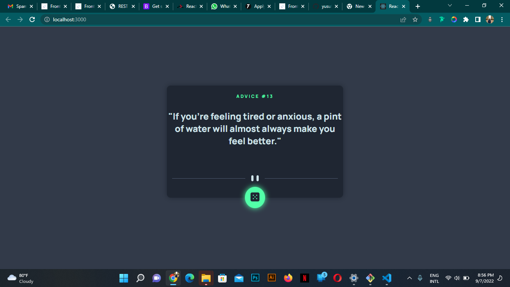

# Advice-Generator
# Frontend Mentor - Advice generator app solution

This is a solution to the [Advice generator app challenge on Frontend Mentor](https://www.frontendmentor.io/challenges/advice-generator-app-QdUG-13db). 
Frontend Mentor challenges help you improve your coding skills by building realistic projects.

## Table of contents

- [Overview](#overview)
  - [The challenge](#the-challenge)
  - [Screenshot](#screenshot)
  - [Links](#links)
  - [Built with](#built-with)
  - [What I learned](#what-i-learned)
- [Author](#author)

### The challenge

Users should be able to:

- View the optimal layout for the app depending on their device's screen size
- See hover states for all interactive elements on the page
- Generate a new piece of advice by clicking the dice icon

### Screenshot

### Links

- Solution URL: [GitHub Link](https://github.com/yusuf-burhanpur/Advice-Generator)
- Live Site URL: [Advice Generator Live](https://advice-generator-6106c.web.app/)

### Built with

- Semantic HTML5 markup
- CSS custom properties
- Flexbox
- CSS Grid
- Mobile-first workflow
- [React](https://reactjs.org/) - JS library

### What I learned

I ahve learned about justify-content property of css and flexbox property in this challenge

## Author

- Frontend Mentor - [@yusuf-burhanpur](https://www.frontendmentor.io/profile/yusuf-burhanpur)
- LinkdIn - [@yusuf-burhanpurwala](https://www.linkedin.com/in/yusuf-burhanpurwala-a452ba242/)
